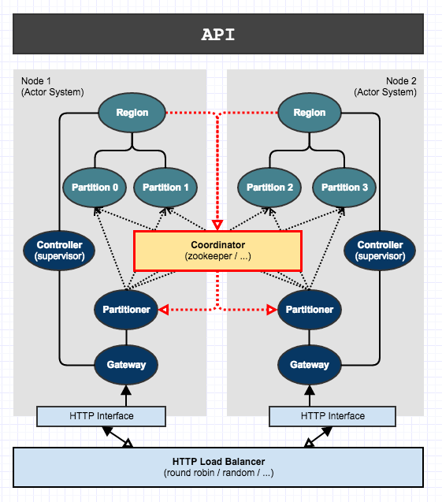

# Design Goals 

 - library for building stateful, scalable REST APIs
 - can be attached to stream-processing systems 
 - fault-tolerance build on top of a distributed-log
 - horizontally scalable
 - zero-downtime possible
 
# Architecture
 

## Cluster Overview

 

 - akka for asynchronous communication 
 - akka http as the main interface
 - zookeeper for distributed coordiation

## State Management

All data is stored in the physical storage in the form
of change log, e.g. Kafka compacted topic. Each physical partition
can have multiple active API Partitions, one of which is 
always a master and the remainder are standby(s). 

In the most consistent setup, master takes all reads and writes 
and records each write in the storage change log while reads
come directly from the in-memory data set.
After storage has accepted the write, master updates its own 
in-memory state - this way the level of write consistency can
be controlled by simply configuring the appropriate ack level
in the underlying storage.

Standby(s) tail the changelog continuously and keep their 
in-memory state up-to-date. In in the event of master failure, 
one of the standby(s) is picked to be the new master. This way
zero-downtime is possible for both failures as well as upgrades.

In cases where eventual read consistency is sufficient, standby(s) 
can also be used as read replicas (this is currently not implemented
but the design is expecting this to come in future).

# Examples

## Example Graph API

This example demonstrates a graph data served via API which
maintains connected-components constant time read characteristics.

The underlying topic which back the mem store should have 4 
partitions which can be created from kafka installation home dir:
 
    ./bin/kafka-topics.sh --zookeeper localhost:2181 --topic graph \
        --create --partitions 4 --replication-factor 2 --config cleanup.policy=compact
    
    ./bin/kafka-topics.sh --zookeeper localhost:2181 --topic settings \ 
        --create --partitions 1 --replication-factor 2 --config cleanup.policy=compact

A single node may be started with one region
serving all 4 partitions byt starting `RestApiNode` with
the following arguments:

    ExampleSystem 2551 127.0.0.1 8081 4 0,1,2,3

For pseudo-distributed mode, the `ExampleApp` can be launched
which will run 2 nodes locally each taking 2 of the 4 partitions.

    