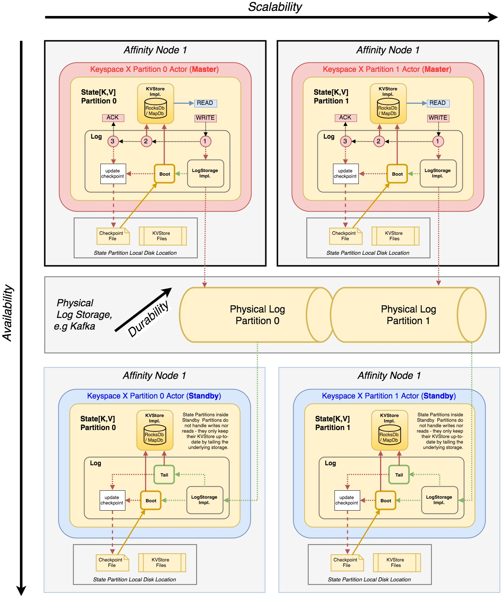

### Build Status 

- [Design Goals](#design-goals)
- [Architecture](#architecture)
  * [Basic principles](#basic-principles)
  * [Http Layer](#http-layer)
  * [Serialization](#serialization)
  * [Distributed coordination](#distributed-coordination)
    + [Failover](#failover)
  * [State Management](#state-management)
    + [Notes on consistency](#notes-on-consistency)
- [Configuration](#configuration)
  * [Logging](#logging)
  * [Avro](#avro)
  * [Coordinator](#coordinator)
  * [Global State](#global-state)
  * [Keyspaces](#key-space-definitions)
  * [Node Context](#node-context)
  * [Important Akka Configuration Options](#important-akka-configuration-options)
- [Development](#development)
  * [Cross-builds](#cross-builds)
    + [Current master versions](#current-master-versions)
    + [Scala 2.11](#scala-211)
  * [JavaScript (affinity.js)](#javascript-affinityjs)

# Design Goals

 - library for building stateful, scalable Data APIs on top of streaming foundation
 - can be attached to stream-processing pipelines based around kafka and participate
   either as a producer/source or consumer/materializer of state
 - fault-tolerance build on top of a distributed-log
 - horizontally scalable and fully asynchronous
 - zero-downtime possible

# Architecture

 

 - Akka as the principal api and internal communication protocol
 - Zookeeper for distributed coordination and elasticity
 - Kafka as a fault-tolerant storage and integration backbone
 - Akka Http as the main interface with websocket layer
 - RocksDb, MemDb, SimpleMap for state store implementations
 - Avro with central schema registry for all serialization

## Basic principles

Affinity is a stream-processor which can be seen as a "micro" world
where kafka ecosystem is the "macro". It is designed with linear
scalability, fault-tolerance, zero-downtime, consistency and elasticity.

Publish/Subscribe model is extended to record-level granularity with
avro univerese reaching from the underlying kafka storage and spark shell
that can present kafka topics as RDD of case classes all the way to
the javascript implementation that is capable of taking schemas from
the central schema registry. With built-in web-socket support on top
of Akka Http a large-scale, efficient and fault tolerant APIs serving
billions of devices can implemented. This way, for example web-socket
clients, which are supported as first-class, can publish and subscribe
events to/from an individual key realm within any number of keyspaces
using super-efficient delta messages serialized with binary avro encoder.

Internally, as well as externally Affinity is a fully event-driven system.
On the outside it offers two interfaces: Stream and Http which  are the entry
to the system:
 - Stream Interface can be used to simply ingest/process external stream
 - Http Interface can be used to define HTTP methods to access the data inside

Both of the interfaces communicate with the internal system only through
akka messages which can be simple ! Tell flows, ? Ask flows or ?? Ack
flows - these a strongly typed versions of Ask with retries, provided by the core module
all the way to complex internal event chains which may result in zero or
more events being fired back to the external systems.

Underneath the Http and Stream Gateway layer there is a common Akka Gateway
that represents all of the Keyspaces as simple actors each managing a set
of partitions - same Keyspace can be referenced by any number of nodes
with a full consistency guaranteed.

Applications typically extend the common Gateway to create traits of functionality
around a keyspace and then mixes them into a higher order traits where orchestrated
behaviours can be implemented. The final composite logic is attached to either
a StreamGateway, HttpGateway or both.

Actors that represent Keyspaces can be referenced in any of the Gateway traits and take
care of the routing of the messages which is designed to mimic the default partitioning
scheme of apache kafka - this is not necessary for correct functioning of the system as
the partitioning scheme is completely embedded within the Affinity universe but it helps
to know that an external kafka producer can be used with its default partitioner to create
a topic which will be completely compatible with affinity's view of the data - this helps
with migrations and other miscellaneous ops.

Keyspace Actor routes all request to Partition Actors which implement the logic over
the data partition - each Keyspace is therefore a dynamic Akka Router which
maintains a copy of the active Partition Actors using internal instance of Coordinator
(see distributed coordination section below).

The system doesn't have any dynamic partition assignment algorithm implemented but there
are some options being considered - all partitions are assigned by configuration. Because
the partitions often leave a sizable footprint in the form of indexes on a local disk
It is therefore not desirable to implement a naive partition assignment but the manual static
assignment is not good either so there are some discussions around a kind of
resonance with the previous state until certain thershold of inbalance is created
by adding or removing nodes, increasing replication factor, etc. - the ground work
for this has been already done at the MemStore level, see State Management section below.

Gateways tend to be the orchestration layer while Keyspaces and their Partitions
 are usually restricted to their scope, however any Actor within the system can hold
 a reference to any defined Keyspace so for example an individual Partition of one Keyspace may
 target another Keyspace as a whole - this allows for full event chains rather then

There ws an experimintal piece of code around lightweight transactions that can be wrapped
around orchestrated logic which use reversible Instructions to compensate failed operations
but this was abandonned as for it to operate consistently distributed locks would have to be used.

### Akka Patterns

Standard Akka Patterns 

- **! Tell** is a basic Akka fire-and-forget messaging pattern:

- **? Ask** is a standard Akka pattern with timeout that can be imported from `akka.patterns.ask`

After importing `io.amient.affinity.core.ack` there are several additional pattens available:

- **?? Typed Ask** is similar to Ask but only messages of type `Reply[T]` can be sent and the response will be of type `T`

- **message(sender) ! T** if message is of type `Reply[T]`, i.e. typed ask, this pattern can be used to respond 

- **message(sender) ! Future[T]** same as above but here it is combined with pipeTo pattern so the future result reaches the sender when completed

- **?! Ack with Retry** is same as ?? Ack but certain errors are retried up to 3 times using the timeout implicit as a delay between retries

- **??? Scatter-Gather** messages of `Scatter[T]` can be sent to multiple actors and the response will be `T` which is combined from
 

## Http Layer

In the Http Gateway, the HTTP Interface is completely async done with Akka Http.
HTTP Handlers participate in handling the incoming HTTP Requests by chaining the
actor handle: Receive method of the GatewayHttp trait.

Handlers translate requests into Akka Messages which may be routed to a partition
or handled directly in the gateway or by orchestrating an internal event flow that
must conclude eventuall in fulfilling the response promise.

WebSockets can be attached to Key-Value entities which then receive automatically
all changes to that entity and the concept can be also extended to push notification
via external delivery system like Google FCM or Apple APN.

## Serialization

Serialization is very important in any distributed data processing system.
Affinity builds around Avro and extends the idea of seamless serialization
and deserialization at all levels of the entire stack - kafka streams,
state stores, akka communication and even spark rdds that are mapped directly
on top of the underlying streams use the same serialization mechanism.
This mechanism is almost completely transparent and allows the application
to work with pure scala case classes rather then generic or generated avro
classes. The schemas and the binary formats produced are however fully
compatible with generic avro records and the data serialized by affinity
can be read by any standard avro client library. When the binary output
is written to kafka topics, affinity serializers can register these schemas
in a central registry, including the standard kafka avro schema registry made
by Confluent with matching binary format so that the deserializer that
ships with schema registry can be used to read the data. Therefore the
serialization abstraction is fairly complicated and central piece.
At its heart is an AvroRecord class which can infer schemas about case
classes and convert between binary, json, avro and case class instances.
At the moment this is done at runtime by reflection but this will be
 replaced by a macro based compile-time version while preserving the
 higher layers that take care of reusability across all system components
 from akka to kafka, rocksdb and spark, etc. Since the schema inference
 and is done by reflection during runtime a series of caches is used to
 give performance character comparable to serializing and deserializing
 generic avro records but the need for these should disappear with a
 macro-based approach.

See [Avro Module](/avro) for more details and examples

## Distributed coordination

Akka Cluster that comes with Akka is not used, instead a custom cluster
management is implemented using a coordinator that allows for dynamic participation
by multiple actor systems.

Keyspace has a precisely defined number of partitions but each partition can be served by multiple
instances, typically on different nodes. Each Keyspace Actor holds references to all Partition
master actors. These references are updated dynamically by the Coordinator object which
listens on ZooKeeper namespace where partitions are registered by their Containers.

If multiple Partitions Actors register for the same physical partition, the Coordinator uses distributed
logic to choose one of them as master and the others become standby.

If any of the partitions hasn't been registered in the ZooKeeper the Keyspace puts the Gateway into a
suspended mode until all partitions are online and registered. When all Keyspaces have all partitions
registered as online, the Gateway is Resumed. Suspension and Resumption events affect the input
traffic of the Gateway - input streams are paused and resumed and http traffic is put on hold for
a configured timeout.

On becoming a Master, the Partition Actor stops consuming (tailing) the the
underlying topic, because the master receives all the writes, its in-memory
state is consistent and it only publishes to the kafka for future bootstrap
and keeping other standby(s) for the partitions up to date.

On becoming a Standby, the Partition Actor resumes consuming the underlying topic
and stops receiving until it again becomes a master. Standby is not a read replica
at the moment but it could be an option however the applications implemented
with the current master-exclusivity tend to be quite simple and still scale well
horizontally by the means of partitioning - read-replicas would break the possibility
 of total consistency when required.
 
### Failover

When a partition master is taken down or fails, one of the standby replicas is selected 
as a new master. There is a gap between the master failing and the standby replica taking over which
 should be very short if the standby was up to date but may be a few seconds in any case. 
 This means all the actor references in the routing tables of Keyspace actors will change 
 but some of the messages to the original actors may already be in flight and will thus 
 not be delivered. Depending on type of messaging pattern used, the behaviour will be as follows:

    keyspace ! message
    
The above is a tell pattern which is essentially fire and forget. In this situation the message
that was routed to the failed master will simply get lost and won't be retried and the sender
will not know about the loss.

    implicit val timeout = Timeout(1 second)
    keyspace ? message 
    
The above is an ask pattern. If the message is routed to the failed master before the standby
replica takes over, the delivery will fail and the sender will get a timeout after 1 second.
Redelivery will not be attempted.

    implicit val timeout = Timeout(1 second)
    keyspace ack message
    
The above is an ack pattern which also entails retries in case of timeout. 2 retries are attempted
 by default. With this pattern the fail-over will be completely transparent if the standby replica
 takes over within 3 attempts, i.e. 3 seconds, otherwise the sender will get a timeout on the future
 as in the case of ask pattern.

## State Management

All data is stored 1) in the persistent storage in the form
of change log, e.g. Kafka compacted topic and 2) in a memstore implementation, e.g. RocksDb.
Each physical partition has one exclusive owner - master - for both reads and writes which
is then tailed by all standby replicas. A single Storage Partition can have multiple active
Affinity Partitions, one of which is always a master and the remainder are standby(s).

Each Affinity Partition, whether master or standby, maintains a checkpoint for a
concrete storage layer which says how far is the memstore up to date with the storage log.
Upon startup or when a partition becomes a master, the memstore is bootstrapped
from the last recorded checkpoint up to the end of the log available in the storage layer.
The checkpoints are periodically stored on a local disk giving the system at-least-once
guarantee in terms of durability - in terms of end-to-end processing it is also
possible to maintain at-least-once guarantee by using the futures returned by write
operations.

As mentioned elsewhere, Keyspace (Actor) manages a set of Partitions (also Actors)
and each Partition can hold multilple state stores whose partitioning scheme will
be aligned with that of the entire overarching Keyspace, however each
state can define specific details about how to store the data, what type
of memstore to use, what TTL to observe and more.

Each State within a Partition of a Keyspace has a first-class TTL support
on a per-key basis and also offers subscribtion at the key level - this
is for example used by the WebSocket support described below.

For kafka 0.11 and higher there is an AdminClient that is used to
   automatically create and re-configure the underlying topics, including
   the compaction, replication, retention and other aspects derived from
   the overarching Keyspace properties and individual State properties.

Master takes all reads and writes and records each write in the storage change log
while reads come directly from the in-memory data set.
After storage has accepted the write, master updates its own 
in-memory state - this way the level of data loss acceptance can
be controlled by simply configuring the appropriate ack level
in the underlying storage.

Standby(s) tail the changelog continuously and keep their 
in-memory state up-to-date. In in the event of master failure, 
one of the standby(s) is picked to be the new master. This way
zero-downtime is possible for both failures as well as upgrades.

As described above, the system currently doesn't have any dynamic partition assignment
as the assignment algorithm must not be naive and the system should tend to
stay in the assignment if the cost of moving the partition is too high, until
a certain thershold of imbalance is reached. The state partitions can already be rebuilt
from the changelog whenever they move host while each host maintains last known
checkpoint for all partitions it has hosted previously.
For the partitions that are currently assigned to a host bootstrap is practically instantaneous
while for partitions that have been hosted before but have been later reassigned
the bootsrap may be partial. While still some partitions may need to be bootstrapped completely
in case of completely new assignment or checkpoint corruption.

### Notes on consistency

The State described above applies to Keyspaces - these are represented
by a Keyspace actor that routes all messages to all of its Partition
actors. Since actors are single-threaded and there is only one master
actor per partition the integrity of reads and writes is guaranteed.

Since master takes all reads and writes, the system is always
fully consistent but relies solely on partitioning for scaling out.
The replicas server only as hot standbys providing high availability.

In cases where eventual read consistency is sufficient, standby(s)
could also be used as read replicas but this is currently not implemented.

Sometimes it is necessary to use global state rather than partitioned
Keyspace. In this case all gateways that hold reference to a global
state see the same data. It is a useful concept, similar to broadcast
variables in batch processors but because Affinity provides
a read-write api on top of its stores, the global state consistency
is not as strong as that of partitioned Keyspace because there is not
a single actor guarding it.

# Configuration

Affinity uses HOCON configuration which has a default under core/affinity.conf.
This file mostly contains akka defaults and is separate from Akka's reference.conf
to avoid collisions. Applications typically have their own configuration layered
on top of the default affinity.conf and these may themselves be multilayered - e.g.
there is one conf file that describes the application without deployment details
and then there are thin deployment-specific conf files for various environments.

Internally Affinity has its own type-safe configuration abstraction that is initialized
from the HOCON conf files. These type-safe configuration descriptors handle validation,
enforcement of requirements and messaging around invalid settings.

## Logging

Affinity uses SLF4j and it also redirects all Akka logging to SLF4J.
It doesn't provide any binding for compile configuration, that is left to applications.
In all examples and for all tests, logback binding is used.

## Avro
        affinity.avro.schema.registry.class [FQN] (!)                                           one of ConfluentSchemaRegistry, ZookeeperSchemaRegistry or MemorySchemaRegistry from the io.amient.affinity.avro package

### Avro (io.amient.affinity.avro.ConfluentSchemaRegistry)
        affinity.avro.schema.registry.url [URL] (http://localhost:8081)                         Confluent Schema Registry connection base URL

### Avro (io.amient.affinity.avro.ZookeeperSchemaRegistry)
        affinity.avro.schema.registry.zookeeper.connect [STRING] (!)                            Coma-separated list of host:port zookeeper servers
        affinity.avro.schema.registry.zookeeper.timeout.connect.ms [INT] (6000)                 Time-out for establishing connection to zookeeper cluster
        affinity.avro.schema.registry.zookeeper.timeout.session.ms [INT] (10000)                Time-out after which any ephemeral nodes will be removed for a lost connection
        affinity.avro.schema.registry.zookeeper.root [STRING] (/affinity-schema-registry)       znode under which schemas will be stored

### Avro (io.amient.affinity.avro.LocalSchemaRegistry)
        affinity.avro.schema.registry.path [FILE-PATH] (!)                                      local file path under which schemas will be stored

### Avro (io.amient.affinity.avro.MemorySchemaRegistry)
        affinity.avro.schema.registry.id [INT] (-)                                              multiple instances with the same id will share the schemas registered by any of them

## Coordinator
        affinity.coordinator.class [FQN] (io.amient.affinity.core.cluster.CoordinatorZk)        implementation of coordinator must extend cluster.Coordinator

### Coordinator (io.amient.affinity.core.cluster.CoordinatorZk)
        affinity.coordinator.zookeeper.connect [STRING] (!)                                     Coma-separated list of host:port zookeeper servers
        affinity.coordinator.zookeeper.timeout.connect.ms [INT] (6000)                          Time-out for establishing connection to zookeeper cluster
        affinity.coordinator.zookeeper.timeout.session.ms [INT] (10000)                         Time-out after which any ephemeral nodes will be removed for a lost connection
        affinity.coordinator.zookeeper.root [STRING] (/affinity)                                znode under which coordination data between affinity nodes will be registered

### Coordinator (io.amient.affinity.core.cluster.CoordinatorEmbedded)
        affinity.coordinator.embedded.id [INT] (!)                                              embedded coordinator instances must have the same id to work together

## Global State
        affinity.global [<ID>] (-)                                                              each global state has an ID and needs to be further configured
        affinity.global.<ID>.external [TRUE|FALSE] (false)                                      If the state is attached to a data stream which is populated and partitioned by an external process - external state becomes readonly
        affinity.global.<ID>.lock.timeout.ms [INT] (10000)                                      When per-row locking is used, this time-out specifies how long a lock can be held by a single thread
        affinity.global.<ID>.memstore.class [FQN] (!)                                           Implementation of storage.MemStore that will be used for lookups
        affinity.global.<ID>.memstore.data.dir [FILE-PATH] (-)                                  Local path where data of this MemStore will be kept - this setting will be derived from the node.data.dir if not set
        affinity.global.<ID>.memstore.key.prefix.size [INT] (-)                                 Number of head bytes, used for optimized range lookups - this setting will be automatically generated for AvroRecord classes which declare Fixed fields
        affinity.global.<ID>.min.timestamp.ms [LONG] (0)                                        Any records with timestamp lower than this value will be immediately dropped
        affinity.global.<ID>.storage.class [FQN] (-)                                            Implementation of storage.LogStorage which will be used for persistence
        affinity.global.<ID>.storage.commit.interval.ms [LONG] (5000)                           Frequency at which consumed records will be committed to the log storage backend
        affinity.global.<ID>.storage.commit.timeout.ms [LONG] (30000)                           Number of milliseconds after which a commit is considered failed
        affinity.global.<ID>.storage.min.timestamp.ms [LONG] (0)                                Any records with timestamp lower than this value will be immediately dropped - if not set, this settings will be derived from the owning state, if any.
        affinity.global.<ID>.ttl.sec [INT] (-1)                                                 Per-record expiration which will based off event-time if the data class implements EventTime trait

### Global State Storage(io.amient.affinity.kafka.KafkaLogStorage)
        affinity.global.<ID>.storage.kafka.bootstrap.servers [STRING] (!)                       kafka connection string used for consumer and/or producer
        affinity.global.<ID>.storage.kafka.consumer                                             any settings that the underlying version of kafka consumer client supports
        affinity.global.<ID>.storage.kafka.consumer.group.id [STRING] (-)                       kafka consumer group.id will be used if it backs an input stream, state stores manage partitions internally
        affinity.global.<ID>.storage.kafka.producer                                             any settings that the underlying version of kafka producer client supports
        affinity.global.<ID>.storage.kafka.replication.factor [INT] (1)                         replication factor of the kafka topic
        affinity.global.<ID>.storage.kafka.topic [STRING] (!)                                   kafka topic name

### Global State Memstore(io.amient.affinity.core.storage.rocksdb.MemStoreRocksDb)

## Keyspaces
        affinity.keyspace [<ID>] (-)                                                            
        affinity.keyspace.<ID>.class [FQN] (!)                                                  Implementation of core.actor.Partition of whose instances is the Keyspace composed
        affinity.keyspace.<ID>.num.partitions [INT] (!)                                         Total number of partitions in the Keyspace
        affinity.keyspace.<ID>.state [<ID>] (-)                                                 Keyspace may have any number of States, each identified by its ID - each state within a Keyspace is co-partitioned identically
        affinity.keyspace.<ID>.state.<ID>.external [TRUE|FALSE] (false)                         If the state is attached to a data stream which is populated and partitioned by an external process - external state becomes readonly
        affinity.keyspace.<ID>.state.<ID>.lock.timeout.ms [INT] (10000)                         When per-row locking is used, this time-out specifies how long a lock can be held by a single thread
        affinity.keyspace.<ID>.state.<ID>.memstore.class [FQN] (!)                              Implementation of storage.MemStore that will be used for lookups
        affinity.keyspace.<ID>.state.<ID>.memstore.data.dir [FILE-PATH] (-)                     Local path where data of this MemStore will be kept - this setting will be derived from the node.data.dir if not set
        affinity.keyspace.<ID>.state.<ID>.memstore.key.prefix.size [INT] (-)                    Number of head bytes, used for optimized range lookups - this setting will be automatically generated for AvroRecord classes which declare Fixed fields
        affinity.keyspace.<ID>.state.<ID>.min.timestamp.ms [LONG] (0)                           Any records with timestamp lower than this value will be immediately dropped
        affinity.keyspace.<ID>.state.<ID>.storage.class [FQN] (-)                               Implementation of storage.LogStorage which will be used for persistence
        affinity.keyspace.<ID>.state.<ID>.storage.commit.interval.ms [LONG] (5000)              Frequency at which consumed records will be committed to the log storage backend
        affinity.keyspace.<ID>.state.<ID>.storage.commit.timeout.ms [LONG] (30000)              Number of milliseconds after which a commit is considered failed
        affinity.keyspace.<ID>.state.<ID>.storage.min.timestamp.ms [LONG] (0)                   Any records with timestamp lower than this value will be immediately dropped - if not set, this settings will be derived from the owning state, if any.
        affinity.keyspace.<ID>.state.<ID>.ttl.sec [INT] (-1)                                    Per-record expiration which will based off event-time if the data class implements EventTime trait

### Keyspaces Storage(io.amient.affinity.kafka.KafkaLogStorage)
        affinity.keyspace.<ID>.state.<ID>.storage.kafka.bootstrap.servers [STRING] (!)          kafka connection string used for consumer and/or producer
        affinity.keyspace.<ID>.state.<ID>.storage.kafka.consumer                                any settings that the underlying version of kafka consumer client supports
        affinity.keyspace.<ID>.state.<ID>.storage.kafka.consumer.group.id [STRING] (-)          kafka consumer group.id will be used if it backs an input stream, state stores manage partitions internally
        affinity.keyspace.<ID>.state.<ID>.storage.kafka.producer                                any settings that the underlying version of kafka producer client supports
        affinity.keyspace.<ID>.state.<ID>.storage.kafka.replication.factor [INT] (1)            replication factor of the kafka topic
        affinity.keyspace.<ID>.state.<ID>.storage.kafka.topic [STRING] (!)                      kafka topic name

### Keyspaces Memstore(io.amient.affinity.core.storage.rocksdb.MemStoreRocksDb)

## Node Context
        affinity.node.container [<ID>] (-)                                                      Array of partitions assigned to this node, <ID> represents the Keyspace, e.g. assigning first four partitions of MyKeySpace: affinity.node.container.MyKeySpace = [0,1,2,3] 
        affinity.node.container.<ID> [[]] (!)                                                   
        affinity.node.data.dir [FILE-PATH] (./.data)                                            Location under which any local state or registers will be kept
        affinity.node.gateway.class [FQN] (-)                                                   Entry point class for all external requests, both http and stream inputs
        affinity.node.gateway.http.host [STRING] (!)                                            host to which the http interface binds to
        affinity.node.gateway.http.max.websocket.queue.size [INT] (100)                         number of messages that can be queued for delivery before blocking
        affinity.node.gateway.http.port [INT] (!)                                               port to which the http interface binds to
        affinity.node.gateway.http.tls.keystore.file [STRING] (-)                               file which contains the keystore contents, if resource not used
        affinity.node.gateway.http.tls.keystore.password [STRING] (!)                           password to the keystore file
        affinity.node.gateway.http.tls.keystore.resource [STRING] (-)                           resource which holds the keystore, if file not used
        affinity.node.gateway.http.tls.keystore.standard [STRING] (PKCS12)                      format of the keystore
        affinity.node.gateway.stream [<ID>] (-)                                                 External input and output streams to which system is connected, if any
        affinity.node.gateway.stream.<ID>.class [FQN] (-)                                       Implementation of storage.LogStorage which will be used for persistence
        affinity.node.gateway.stream.<ID>.commit.interval.ms [LONG] (5000)                      Frequency at which consumed records will be committed to the log storage backend
        affinity.node.gateway.stream.<ID>.commit.timeout.ms [LONG] (30000)                      Number of milliseconds after which a commit is considered failed
        affinity.node.gateway.stream.<ID>.min.timestamp.ms [LONG] (0)                           Any records with timestamp lower than this value will be immediately dropped - if not set, this settings will be derived from the owning state, if any.
        affinity.node.gateway.suspend.queue.max.size [INT] (1000)                               Size of the queue when the cluster enters suspended mode
        affinity.node.name [STRING] (AffinityNode)                                              ActorSystem name under which the Node presents itself in the Akka Cluster
        affinity.node.shutdown.timeout.ms [INT] (30000)                                         Maximum time a node can take to shutdown gracefully
        affinity.node.startup.timeout.ms [INT] (2147483647)                                     Maximum time a node can take to startup - this number must account for any potential state bootstrap

### Node Context Stream(io.amient.affinity.kafka.KafkaLogStorage)
        affinity.node.gateway.stream.<ID>.kafka.bootstrap.servers [STRING] (!)                  kafka connection string used for consumer and/or producer
        affinity.node.gateway.stream.<ID>.kafka.consumer                                        any settings that the underlying version of kafka consumer client supports
        affinity.node.gateway.stream.<ID>.kafka.consumer.group.id [STRING] (-)                  kafka consumer group.id will be used if it backs an input stream, state stores manage partitions internally
        affinity.node.gateway.stream.<ID>.kafka.producer                                        any settings that the underlying version of kafka producer client supports
        affinity.node.gateway.stream.<ID>.kafka.replication.factor [INT] (1)                    replication factor of the kafka topic
        affinity.node.gateway.stream.<ID>.kafka.topic [STRING] (!)                              kafka topic name

## Important Akka Configuration Options
        akka.actor.provider [STRING] (-)                                                        Set this to "akka.remote.RemoteActorRefProvider" when running in a cluster
        akka.http.server.idle-timeout [STRING] (infinite)                                       
        akka.http.server.max-connections [INT] (1000)                                           
        akka.http.server.remote-address-header [STRING] (on)                                    
        akka.http.server.request-timeout [STRING] (30s)                                         
        akka.http.server.server-header [STRING] (-)                                             
        akka.remote.enabled-transports [[]] (-)                                                 Set this to ["akka.remote.netty.tcp"] when running in a cluster
        akka.remote.netty.tcp.hostname [STRING] (-)                                             
        akka.remote.netty.tcp.port [INT] (-)                                                    

# Development 

The codebase is split into several modules, some of which can and should be used independently
of the akka core:

 - `api` is the internal programming api and utiliities for writing memstore and storage plugins (Java)
 - `avro` scala case class <--> generic avro conversion with schema registry wrappers (Scala)
 - `core` is the main scala library with js-avro extension (Scala)
 - `examples/..` contain example applications (Scala)
 - `kafka/avro-formatter-kafka` kafka formatter for console consumer for the `avro` module (Scala)
 - `kafka/avro-serde-kafka` kafka produer serializer and consumer deserializer for the `avro` module (Scala)
 - `kafka/storage-kafka` module with kafka storage and binary stream implementations
 - `kafka/test-util-kafka` provides EmbeddedZooKeeper, EmbeddedKafka and EmbeddedCfRegistry for testing
 - `rocksdb` module with RocksDb implementation of the MemStore (Java)
 - `spark` uses the underlying stream storage as CompactRDD with all the serde magic
 - `ws-client` custom web socket with avro support (Java)

### Cross-builds

Currently the Akka, Akka Http and Akka Streams are held constant while other components can be
cross-built: different Kafka, Spark and Scala versions can be created. At the moment only
Scala 2.11 is there but once all the Akka and Akka Http modules are available in 2.12 they will appear here.

Maintained crossbuilds appear as `master-<variant>` branches and are always up to date with the current `master`.
On a clean working directory you can use `zzz` script which runs various gradle commands across
all master branches.

    ./zzz test

    ./zzz install

#### Current master versions

    Scala **2.11.8**
    Kafka **1.0.0**
    Confluent **4.0.0**
    Spark **2.2.1**

The `zzz` script uses git and gradle to switch between the maintained master branches
and different variants of scala, kafka and spark.

#### Scala 2.11
    - core-scala_2.11
    - kafka_0.10-scala_2.11 (Kafka 0.10.2.1, Confluent 3.2.2)
    - kafka_0.11-scala_2.11 (Kafka 0.11.0.2, Confluent 3.3.1)
    - kafka_1.0-scala_2.11 (Kafka 1.0.0, Confluent 4.0.0)
    - spark_2.0-scala_2.11 (Spark 2.0.2)

## JavaScript (affinity.js)

There is affinity_node.js file which contains the source for avro
web socket implementation. It is based on a node avsc.js library:

    npm install avsc

To generate final affinity.js for borwsers:

    npm install -g browserify

When working on this script the browser script affinity.js can
be generated then by:

    browserify core/src/main/resources/affinity_node.js -o core/src/main/resources/affinity.js
    
When doing a lot of work on the javascript watchify can be used
  to automatically generate the new affinity.js when the affinity_node.js
  is modified:

    npm install -g watchify
    watchify core/src/main/resources/affinity_node.js -v -o core/src/main/resources/affinity.js -d

